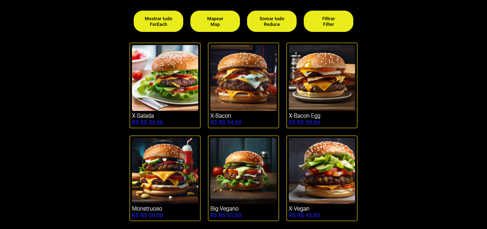

<h1>Burgues</h1>
É um projeto que aprendi no DevClub  para aprender mais sobre HTML, CSS e JavaScript. O projeto apresenta uma lista de produtos, com informações sobre preços, descontos e especificações.

<h2>Habilidades recentes:</h2>

Aprendi as funções ForEach, Map, Reduce e Filter do JavaScript.

<h2>Contato:</h2>

> linkedin: https://www.linkedin.com/in/dalio-s-yamada/

#HTML #CSS #JavaScript #Programação # Desenvolvedor Web #DesenvolvedorFrontEnd #DesenvolvedorFullStack #TransiçãoDeCarreira #Oportunidades #DisponívelParaTrabalho

>projeto burguer: https://daliosy.github.io/burger/

